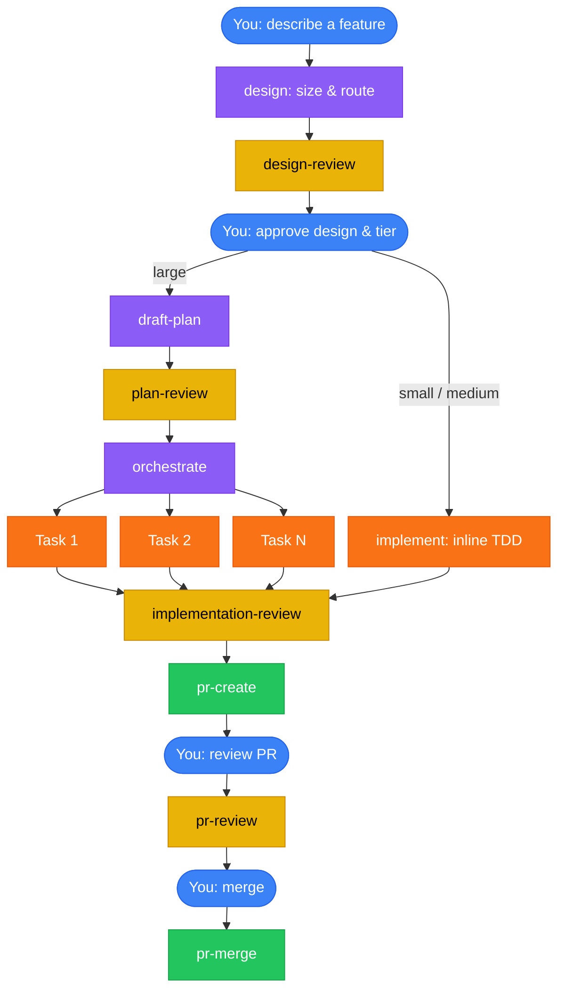

<div align="center">


# claude-caliper

**Measure twice, cut once.**

A Claude Code plugin that turns your goal into a PR with as little friction as possible. It sizes the work first and applies only as much process as it needs, and every integrated diff is reviewed by a fresh-context subagent. You get a design-gated, test-driven PR — with three human decisions.

[](LICENSE)
[](https://github.com/nikhilsitaram/claude-caliper/releases)
[](https://claude.ai/code)
[](skills/)

</div>

---

## The Problem

Many claude workflows are either improperly context engineered, overly complicated, or don't understand how to effectively use AI agents. This tool tries to be different. We don't lock Claude in a box, but we have fresh agents check work as it goes to ensure perfection.

## The Fix

Install claude-caliper. Describe what you want to build. Walk away.

The plugin installs 17 skills that fire automatically at the right moment, enforcing a full development workflow: **design before code, test before merge.** The design skill sizes the work first and routes it — small and medium changes take an inline fast path, large ones fan out through a validated plan. You make three decisions — approve the design, review the PR, and confirm the merge — and everything between runs as a chain of fresh subagents with zero manual handoffs.

---

## What a Session Looks Like

You say:

> "Add rate limiting middleware with per-route config and 429 responses with retry-after headers"

That's a medium-sized change, so the pipeline runs:

| Step | What happens | Who |
|------|-------------|-----|
| 1 | Claude sizes the work, challenges your assumptions, proposes 2-3 approaches with trade-offs | You + Claude |
| 2 | You approve a design and its tier | **You** |
| 3 | Design review validates the short doc against a 9-point checklist | Fresh subagent |
| 4 | The `implement` skill runs RED-GREEN-REFACTOR inline in the session, committing as it goes | Claude (main session) |
| 5 | Implementation review does a fresh-eyes holistic pass over the diff | Fresh subagent |
| 6 | Create PR opens a PR | Automated |
| 7 | You review the PR and run `/pr-review` | **You** |
| 8 | PR reviewer reads the diff cold before any external feedback | Subagent |
| 9 | Fixes applied, feedback addressed | Automated |
| 10 | You run `/pr-merge` — squash merge, branch cleaned up | **You** |

Steps 3-6 run without any input from you.

The pipeline scales with size. A **small** change (≤~2 files) skips the design doc entirely — an in-conversation design and your approval are enough. A **large** feature (genuine parallelism or dependency layers) inserts draft-plan and plan-review after the design gate, and `orchestrate` fans the work out across parallel task subagents instead of implementing inline. Every tier converges on the same finish: one independent implementation-review, then the PR chain.

---

## How It Works



<sup>Blue = human decisions (3 total) · Purple = creative work · Orange = TDD implementation · Yellow = review gates · Green = shipping · The `implement` fast path (small/medium) and the draft-plan → orchestrate path (large) converge on a single implementation-review.</sup>

---

## Quick Start

### 1. Install

```bash
/plugin marketplace add nikhilsitaram/claude-caliper
/plugin install claude-caliper@claude-caliper
```

Restart Claude Code.

### 2. Use

Start a new session and describe something you want to build. The design skill fires automatically — no slash commands needed.

### 3. Verify

If Claude immediately starts discussing approaches and trade-offs instead of writing code, the plugin is working.

### Packages

Install only what you need:

| Package | What you get | Install command |
|---------|-------------|-----------------|
| **claude-caliper** | All 17 skills | `/plugin install claude-caliper@claude-caliper` |
| **claude-caliper-workflow** | Design-to-merge pipeline (11 skills) | `/plugin install claude-caliper-workflow@claude-caliper` |
| **claude-caliper-tooling** | Codebase review + test audit + skill eval + queue + usage-guard + session handoff (6 skills) | `/plugin install claude-caliper-tooling@claude-caliper` |

### Updating

Re-run the install command to update to the latest version. Claude Code compares your cached version against the declared version and pulls the new one.

---

## Skills Reference

### Pipeline (auto-triggered)

These skills chain automatically. You trigger the first one by describing what to build; the last one by saying "merge."

| Stage | Skill | What happens |
|-------|-------|-------------|
| **Design** | [design](skills/design/) | Sizes the work, challenges assumptions, proposes 2-3 approaches, asks you to pick one and confirm the tier (Small/Medium/Large) |
| **Design Gate** | [design-review](skills/design-review/) | 9-point validation: problem clarity, success criteria, architecture fit, scope alignment, test strategy coverage, handoff quality |
| **Fast path** (small/medium) | [implement](skills/implement/) | Inline RED-GREEN-REFACTOR in the current session — no plan.json, no task files, no orchestration; frequent commits, then hands off to one review |
| **Planning** (large) | [draft-plan](skills/draft-plan/) | Structured `plan.json` manifest with per-task intent, exact file paths, verification commands, and `avoid` rules — the only per-task artifact (no per-task `.md` files) |
| **Plan Gate** (large) | [plan-review](skills/plan-review/) | Catches vague intent, missing file paths, design-plan drift, the "Different Claude Test" |
| **Execution** (large) | [orchestrate](skills/orchestrate/) | Dispatches each task as a parallel subagent with worktree isolation (parallel within a phase, phases sequential) |
| **Review Gate** | [implementation-review](skills/implementation-review/) | The single independent fresh-eyes review over the integrated diff — one holistic pass (per phase for large plans) |
| **Create PR** | [pr-create](skills/pr-create/) | Commits, rebases, tests, pushes, opens PR with structured summary |
| **Review PR** | [pr-review](skills/pr-review/) | PR review before reading external feedback, addresses comments, posts assessment |
| **Merge** | [pr-merge](skills/pr-merge/) | Confirms merge, squash merges, cleans up branches and worktrees |

### Standalone Tools

| Skill | Trigger | What it does |
|-------|---------|-------------|
| [codebase-review](skills/codebase-review/) | `/codebase-review [path]` | Whole-repo audit with parallel subagents per directory, cross-scope reconciliation, findings triaged by fix complexity |
| [test-audit](skills/test-audit/) | `/test-audit [path] [--diff]` | Audits the test suite for false-pass risk, flakiness, weak assertions, and isolation smells; surfaces findings, dispatches implementers to fix approved ones, offers to record testing conventions |
| [skill-eval](skills/skill-eval/) | `/skill-eval` | Assertion-based grading, blind A/B comparison, adversarial scenarios, variance analysis |

### Usage-window scheduling

Defer or pace work around Claude's 5-hour usage window. **macOS-only**, and reset-mode needs a one-time statusline setup — see [queue/README](skills/queue/README.md).

| Skill | Trigger | What it does |
|-------|---------|-------------|
| [queue](skills/queue/) | `/queue [<when>] <commands>` | Schedule commands to fire later in the same session via a one-shot cron — by default ~90s after the 5h window resets (fresh quota), or at a time/duration you name |
| [usage-guard](skills/usage-guard/) | `/usage-guard [--queue] [--at <pct>] <task>` | Work a task continuously until 5h usage hits a threshold (default 99%), then stop and report — or with `--queue`, chain the remainder into the next block |

### Session handoff

Delegate scoped work to a fresh, visible Claude session in a new pane. **macOS + iTerm2-only**, and needs a one-time macOS Automation grant — see [handoff/README](skills/handoff/README.md).

| Skill | Trigger | What it does |
|-------|---------|-------------|
| [handoff](skills/handoff/) | `/handoff <slug>` | Splits the current iTerm2 window, launches a fresh `claude` in the new pane, and relays a self-contained brief to it over cross-session messaging — a peer session you can watch and steer, unlike a background subagent |

---

## How It Works Under the Hood

<details>
<summary><strong>Why Fresh Context Matters</strong></summary>

When an agent reviews code it just wrote, it rationalizes problems away. It remembers *why* it made every choice, so every choice seems reasonable. This is the same bias code review between humans exists to counter.

claude-caliper spawns a **fresh subagent for every review**:

- The **implementation reviewer** never wrote the code it's checking — it reads the integrated diff cold
- The **pr-review reviewer** forms its own opinion before seeing external feedback
- The **design reviewer** and **plan reviewer** are always fresh agents with zero prior context

No agent ever reviews its own work.

</details>

<details>
<summary><strong>Spec-Driven + Test-Driven Development</strong></summary>

claude-caliper chains two disciplines that are usually practiced separately: **spec-driven development** (validate *what* to build) and **test-driven development** (validate *that* it works). The design doc defines observable success criteria; the plan maps those criteria to tasks; every task follows RED-GREEN-REFACTOR; the implementation review verifies the criteria are met by the final code.

### The Traceability Chain

```text
Design doc         → Success criteria (human-verifiable outcomes, not implementation details)
  ↓
Design review      → Validates criteria are complete, necessary, and implementation-independent
  ↓
Draft plan         → Maps each criterion to one or more tasks with verification commands
  ↓
Plan review        → Checks every criterion is covered by at least one task
  ↓
Implementation     → RED: write failing test → GREEN: make it pass → REFACTOR: clean up
  ↓
Implementation review → Fresh subagent verifies all success criteria met by the integrated code
```

### What Success Criteria Look Like

In the design doc:

```markdown
## Success Criteria
- Users can authenticate via OAuth and receive a session token
- Rate-limited endpoints return 429 with a Retry-After header
- Failed auth attempts are logged with client IP and timestamp
```

These are behavioral outcomes — "users can X", "system does Y" — not implementation details like "JWT middleware installed." This matters because it lets the implementation review verify fulfillment without being anchored to a specific approach.

### How TDD Executes

Whether the work runs inline through `implement` (small/medium) or as a task subagent under `orchestrate` (large), the discipline is the same explicit RED-GREEN-REFACTOR cycle:

```markdown
### Step 1: Rate limit middleware

**RED:** Write test expecting 429 after 10 requests in 1 minute
  → Run: `npm test -- --grep "rate limit"` → expect FAIL (middleware doesn't exist)

**GREEN:** Implement sliding window rate limiter in src/middleware/rate-limit.ts
  → Run: `npm test -- --grep "rate limit"` → expect PASS

**REFACTOR:** Extract config to src/config/rate-limits.ts
  → Run: `npm test` → expect all PASS (no regressions)
```

The implementer follows these cycles exactly — it writes the failing test first, confirms it fails, implements, confirms it passes. The implementation reviewer then verifies the tests actually cover the behavior, not just the happy path.

### Automated Criteria Validation

Beyond TDD, `plan.json` supports machine-runnable success criteria at three levels:

```json
{
  "success_criteria": [
    {
      "run": "curl -s -o /dev/null -w '%{http_code}' localhost:3000/health",
      "expect_output": "200",
      "timeout": 10,
      "severity": "blocking"
    }
  ]
}
```

The orchestrator runs these automatically: task-level criteria after each task, phase-level after each phase, plan-level before marking the plan complete. A blocking failure stops the pipeline.

</details>

<details>
<summary><strong>Structured Plans</strong></summary>

Plans aren't freeform text. They're machine-readable artifacts validated by a schema checker before any LLM reviewer sees them.

### Directory Layout

```text
.claude/claude-caliper/2026-03-21-rate-limiter/
├── design-rate-limiter.md  # Design doc with success criteria
├── plan.json               # Machine-readable manifest (source of truth, schema 2)
├── plan.md                 # Auto-rendered from plan.json (never hand-edited)
├── reviews.json            # Review records (design-review, plan-review, impl-review)
├── phase-a/
│   └── completion.md       # Lead aggregates task outcomes for the phase's single review
└── phase-b/
    └── completion.md
```

> `plan.json` is the single per-task artifact — every task's metadata lives inside it, and there are no per-task `.md` files. There is exactly one `completion.md` per phase, written by the orchestrate lead as the aggregation point for that phase's holistic review.
>
> Plan artifacts are gitignored transient state created by the design and draft-plan skills. They live outside the repo proper so they don't pollute git history.

### plan.json — The Machine-Readable Manifest

Every task specifies its intent, exact files, a verification command, a measurable end state, and the pitfalls to avoid:

```json
{
  "schema": 2,
  "status": "Not Yet Started",
  "workflow": "pr-create",
  "goal": "Add rate limiting with per-route config",
  "architecture": "Sliding window counter in Redis, middleware per route group",
  "tech_stack": "Node.js, Redis, Express",
  "phases": [
    {
      "letter": "A",
      "name": "Core middleware",
      "status": "Not Started",
      "depends_on": [],
      "tasks": [
        {
          "id": "A1",
          "name": "Rate limit middleware",
          "status": "pending",
          "intent": "Add sliding-window rate limiting as Express middleware so per-route groups can cap request rates. This is the foundation task — per-route config in A2 wires into the limiter this task establishes.",
          "depends_on": [],
          "complexity": "medium",
          "files": {
            "create": ["src/middleware/rate-limit.ts", "src/config/rate-limits.ts"],
            "modify": ["src/app.ts"],
            "test": ["tests/middleware/rate-limit.test.ts"]
          },
          "verification": "npm test -- --grep 'rate limit'",
          "done_when": "10 requests in 1 min returns 429 with Retry-After header, 5/5 tests pass",
          "avoid": [
            { "rule": "Don't store counters in process memory", "why": "the app runs multiple instances behind a load balancer; in-memory counters would let each instance grant the full quota independently." }
          ]
        }
      ]
    }
  ]
}
```

### Schema Validation

Before an LLM reviewer ever sees the plan, `validate-plan --schema` runs structural checks:

- **Schema version gate** — a schema-1 plan is rejected immediately with a message naming the change, rather than drowning in unrelated field errors mid-run
- All required fields present at every level, including each task's `intent` and `avoid` (an array of `{rule, why}` objects)
- Phase dependency graph is a valid DAG (BFS cycle detection)
- Task dependencies only reference same or earlier phases
- No duplicate task IDs or file paths across the entire plan
- **File-set isolation** — no two tasks in the same phase share any file path across `create`/`modify`/`test`
- **Task ID prefix matches phase** — task A1 must be in Phase A
- **Phase letters are alphabetically ordered** — A before B before C
- **Status consistency** — phase can't be "Complete" if any task is still pending

Additional runtime gates:
- `--check-deps` verifies all `depends_on` tasks are complete before spawning a dependent task subagent
- `--check-handoffs` / `--add-handoff` record and verify cross-phase handoff notes directly in `plan.json`
- `--criteria` runs machine-executable success criteria at task, phase, and plan levels

This catches structural errors deterministically — no tokens spent on an LLM noticing a missing field.

### Auto-Rendered plan.md

`plan.md` is generated deterministically from `plan.json` — never hand-edited. It updates automatically whenever task or phase status changes during execution, giving you a live progress view:

```markdown
## Phase A — Core middleware
**Status:** In Progress

- [x] A1: Rate limit middleware — *429 with Retry-After, 5/5 tests pass*
- [ ] A2: Per-route config — *Routes load limits from config, 3/3 tests pass*
```

The litmus test for every task: *could a fresh Claude with zero codebase context execute this without asking a single clarifying question?*

</details>

<details>
<summary><strong>Parallel Execution (large tier)</strong></summary>

Large-tier plans fan out through `orchestrate`, which dispatches each task as a parallel subagent (Agent tool) with git-worktree isolation. Parallel subagents are the only way tasks run — there is no agent-teams substrate and no environment variable to set.

### Architecture

```text
Lead (orchestrator) ──dispatches──▶ Task Implementer Subagents (1 per task, parallel within a phase)
                    ──dispatches──▶ Implementation Reviewer (1 per phase, over the merged diff)
```

- **Phases execute sequentially.** Phase B waits until Phase A is fully merged, so it sees Phase A's code.
- **Tasks within a phase execute in parallel.** Each task gets its own subagent with an auto-provisioned git worktree. File-set isolation (no two tasks in the same phase touch the same files) eliminates merge conflicts.
- **One review per phase.** After a phase's tasks merge, a single implementation-review subagent reads the integrated diff — tasks are not reviewed individually.

### Task Lifecycle

```text
Dispatch → Implement (TDD) → Merge task branch → [phase complete] → Implementation review → Fix inline
```

1. The implementer subagent receives the task's `plan.json` entry, the design doc path, and direct codebase access — it reads the code itself rather than working from pasted snippets
2. It implements the task (RED-GREEN-REFACTOR), writes completion notes, marks the task complete
3. The lead merges the task branch into the phase branch
4. Once every task in the phase is merged, the lead dispatches one implementation-review over the phase diff; findings are fixed inline (a two-pass review cap keeps this bounded — one discovery pass, at most one delta pass)
5. Cross-phase handoffs are recorded in `plan.json` via `validate-plan --add-handoff` and surfaced to the next phase

### Dependency Gate

Tasks with `depends_on` don't dispatch until all prerequisites are complete. The lead runs `validate-plan --check-deps` before dispatching any dependent subagent — and since branches merge incrementally, the new worktree always sees prerequisite code.

### File-Set Isolation

Each task declares its file set in `plan.json` (`files.create`, `files.modify`, `files.test`). No two tasks in the same phase may share any file path. This is enforced at three levels:

- **draft-plan** decomposes work with disjoint file sets
- **plan-review** flags tasks that logically need to share files (bad decomposition)
- **validate-plan --schema** deterministically rejects overlapping file sets within a phase

### Single vs Multi-Phase

| Plan type | Branch strategy | Execution model |
|-----------|----------------|---------------|
| Single-phase | Feature branch directly | Task subagents → merge → review → PR to main |
| Multi-phase | `integrate/<feature>` branch | Per-phase task subagents → merge → phase review → final PR to main |

</details>

<details>
<summary><strong>Codebase Review</strong></summary>

Most review tools look at diffs. `codebase-review` audits the whole repo in parallel — one Explore subagent per top-level directory, then a cross-scope reconciliation pass that catches duplication and naming drift the per-directory reviewers can't see.

```bash
/codebase-review              # entire repo
/codebase-review src/         # scoped to a directory
```

Findings are routed by **fix complexity**, not severity:

| Complexity | Route |
|-----------|-------|
| One-liner (any severity) | Inline fix via draft-plan |
| Medium refactor | GitHub issue or plan (your choice) |
| Large architectural | GitHub issue with analysis |

Categories: DRY, YAGNI, Simplicity & Efficiency, Refactoring Opportunities, Consistency.

</details>

<details>
<summary><strong>Skill Eval</strong></summary>

Skills degrade silently. A prompt tweak that looks better might fail on edge cases you didn't test. `skill-eval` quantifies the difference.

- **Assertion-based grading** — a grader subagent checks expected behaviors with cited evidence, not keyword matching
- **Blind A/B comparison** — before/after outputs scored on Content + Structure without knowing which is which
- **Adversarial scenarios** — deadline pressure, "skip testing," ambiguous requirements; surfaces enforcement gaps that positive evals miss
- **Variance analysis** — 3 runs per scenario, mean +/- stddev; distinguishes real improvements from noise

```bash
/skill-eval
```

</details>

---

## Design Principles

**Lean skills.** Each skill is under 1,000 words. Skills teach Claude what it doesn't already know — workflow gates, project conventions, quality thresholds. Every excess word displaces working memory from the actual task.

**Eval-driven.** Dedicated skill refactors and new skills run through `skill-eval` — pass rate + blind comparison + variance. Routine edits use manual review.

**Quality gates, not suggestions.** The workflow stops at design review, plan review, and implementation review. These aren't optional checkpoints — they're where the most expensive rework gets prevented.

**Three human decisions.** You confirm the design direction, review the PR after feedback is addressed, and confirm the merge. Everything between is automated. This isn't about removing humans — it's about putting them at the highest-leverage decision points.

---

## FAQ

**Does it work with any language/framework?**
Yes. Skills are language-agnostic. They auto-detect test runners, respect project conventions, and work with any git repository.

**Can I stop after the plan?**
Yes. After approving the design, you choose: **Create PR** (execute and open PR for human review), **Merge PR** (execute, open PR, review, and merge), or **Plan only** (stop after planning).

**What if the design is wrong?**
The design skill waits for explicit approval. Say "needs changes" and iterate. Nothing proceeds until you approve.

**What about simple changes?**
They take the fast path. A small change (≤~2 files, obvious approach) skips the design doc and plan entirely — the design skill proposes an in-conversation design, you approve it, and the `implement` skill writes the code inline with TDD. There's still a design gate, because even "simple" changes are where unexamined assumptions cause the most wasted work. You can also invoke it directly with `/implement` (or "just implement this") and it will still show you a short design for approval before touching code.

**How does it decide how much process to apply?**
The design skill sizes the work and routes it into one of three tiers. **Small** (≤~2 files, obvious approach) gets an in-conversation design, then inline implementation. **Medium** (one coherent change, the default when in doubt) adds a short design doc and one design-review pass, then inline implementation. **Large** (genuine parallelism, dependency layers, or bulk beyond one sitting) gets the full ceremony: design doc, plan, plan-review, and parallel task execution through `orchestrate`. You confirm the tier when you approve the design.

**Does it modify my git workflow?**
It uses feature branches, worktrees for isolation, and squash merges. It never commits directly to main. All changes go through PRs.

**The design skill isn't firing — Claude just starts coding.**
Restart Claude Code after installing, then start a **new session**. Existing sessions don't pick up plugin changes. If it still doesn't fire, verify the plugin is loaded: run `/plugin` and check that claude-caliper appears in the list.

**How do I update to a newer version?**
Re-run `/plugin install claude-caliper@claude-caliper`. Claude Code compares your cached version against the declared version and pulls the update. Check the [releases page](https://github.com/nikhilsitaram/claude-caliper/releases) for changelogs.

---

## Requirements

- [Claude Code](https://claude.ai/code) v2.1.32+ with plugin support
- Git (for worktree isolation; large-tier plans run task subagents in parallel worktrees)

## License

[MIT](LICENSE)

## Author

[Nikhil Sitaram](https://github.com/nikhilsitaram)
